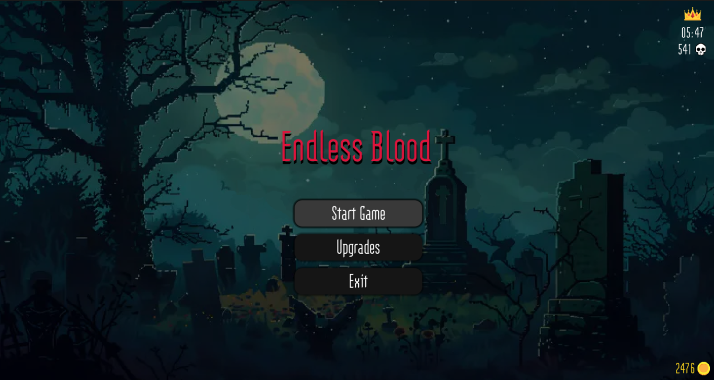
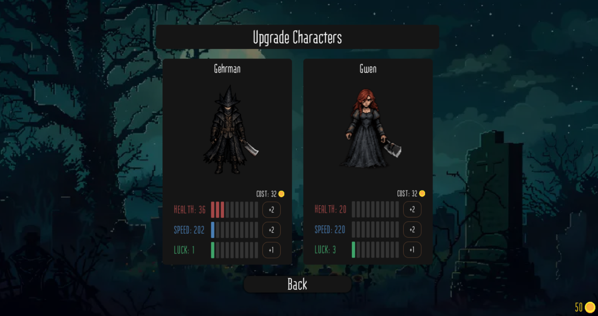
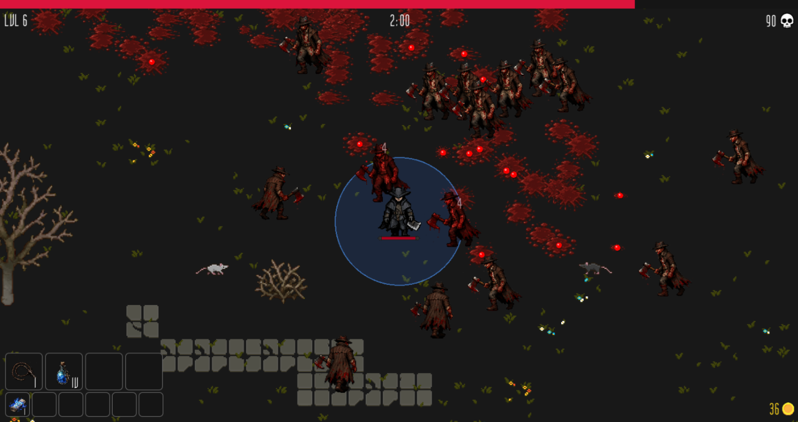
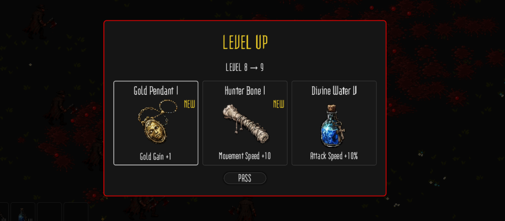
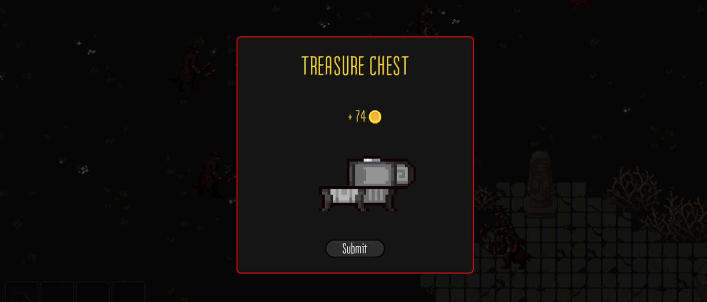

# Endless Blood

> A student project built with free internet assets and DALLE generated artwork.

**Endless Blood** is a fast-paced roguelite survival game inspired by _Vampire Survivors_, set in a gothic world reminiscent of _Bloodborne_.

Collect gold during runs and spend it on permanent upgrades between sessions - making each attempt stronger than the last.

Fight through endless waves of enemies, dodge attacks, and collect XP from kills. The longer you survive, the higher your score.

At each level, you choose one of three options drawn from a pool of new weapons and items, or an upgrade to something you already have.

Some enemies drop treasure chests containing a random amount of gold.

Death is not the end - just the beginning of your next, stronger run.

